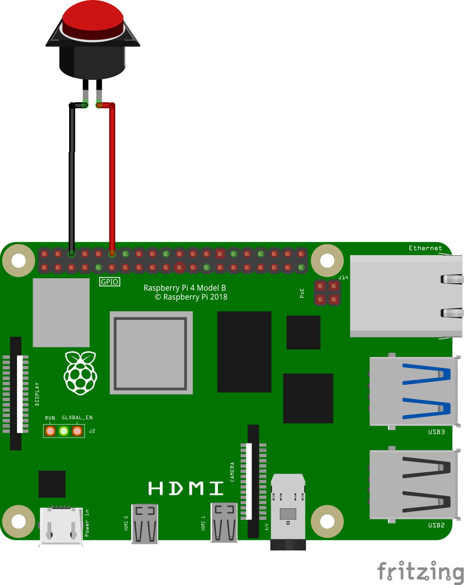

# Set up Google Spreadsheet

## 🧰 Step-by-Step: Enable Google Sheets API and Create a Service Account Key

1️⃣ Create or open a Google Cloud Project
1. Go to https://console.cloud.google.com/.
2. Sign in with your Google account.
3. At the top left, click __Select a project → New Project__.
4. Give it a name (e.g., SendToSheet) and click __Create__.

2️⃣ Enable the Google Sheets API
1. Inside your project, open the __Navigation Menu (☰) → APIs & Services → Library__.
2. In the search bar, type __Google Sheets API__.
3. Click __Google Sheets API__, then click __Enable__.

3️⃣ Create a Service Account
1. Go to __Navigation Menu → IAM & Admin → Service Accounts__.
2. Click __+ Create Service Account__.
3. Enter a name (e.g., `sheet-updater`), click __Create and Continue__.
4. You don’t need to assign any special roles here (you can skip).
5. Click __Done__.

4️⃣ Create a Key File (JSON)
1. In the __Service Accounts__ list, click your new service account.
2. Go to the __Keys__ tab.
3. Click __Add Key → Create new key → JSON__.
4. It will download a file like `sheet-updater-123abc.json`.
   1. Move it into your project folder and rename it something easy, like: 
        ```service_account.json```
   2. __Keep this file secret__ — it grants access to your Google account project.

5️⃣ Share your Google Sheet with the Service Account
1. Open the Google Sheet you want to use.
2. Copy the __email address__ of your service account from the JSON file — it looks like:    
    ```sheet-updater@sendtosheet.iam.gserviceaccount.com```
4. Share your spreadsheet with that email (click "Share" → add as Editor).

6️⃣ Get your Spreadsheet ID
1. Open your Google Sheet in a browser.
2. The URL looks like this:

    ```https://docs.google.com/spreadsheets/d/1AbCdEFghIjKlMnOpQrStUvWxYz1234567890/edit#gid=0```
3. Copy the long ID between /d/ and /edit:

    ```1AbCdEFghIjKlMnOpQrStUvWxYz1234567890```
4. Use that in your Python script:

    ```SPREADSHEET_ID = "1AbCdEFghIjKlMnOpQrStUvWxYz1234567890"```

# Set up Raspberry Pi
Using a Raspberry Pi to send data to a spreadsheet via button press.

## Install Vim
Install vim or use some other terminal editor.

```
sudo apt update
sudo apt install vim
```

## Set up Python environment
In terminal, change directory to your project folder and type:

```python -m venv --system-site-packages .venv```

## Activate the environment
To activate the Python environment, type:

```source .venv/bin/activate```

## Install modules
Next install the modules while in your project's virtual environment:

```pip install gspread google-auth gpiozero rpi-lgpio```

* Note that gpiozero and rpi-lgpio should be installed by default in Raspberry Pi OS

## Set up script to run at boot
To run a Python script within a virtual environment as a systemd service, follow these steps: 

### Create a systemd service file.
Create a new file in `/etc/systemd/system/` with a .service extension (e.g., my_script.service).

```sudo vim /etc/systemd/system/counter.service```

### Add content to the service file.
Populate the service file with the following structure, replacing placeholders with your specific details:

```
[Unit]
Description=Consult Count Button
After=network.target

[Service]
User=counter
WorkingDirectory=/home/counter/consult-buttons
ExecStart=/home/counter/consult-buttons/.venv/bin/python /home/counter/consult-buttons/counter.py
Restart=on-failure
StandardOutput=journal
StandardError=journal

[Install]
WantedBy=multi-user.target
```

### Reload systemd and enable/start the service:
After saving the service file, reload systemd to recognize the new service, then enable it to start on boot and start it immediately:
Code

```
sudo systemctl daemon-reload
sudo systemctl enable counter.service
sudo systemctl start counter.service
```

### Check the service status and logs:
Verify the service status and check for any errors using:

```
systemctl status counter.service
journalctl -u counter.service -f
```


# Hardware Setup
Connect a button to the Raspberry Pi GPIO pin 18 and to GND.

